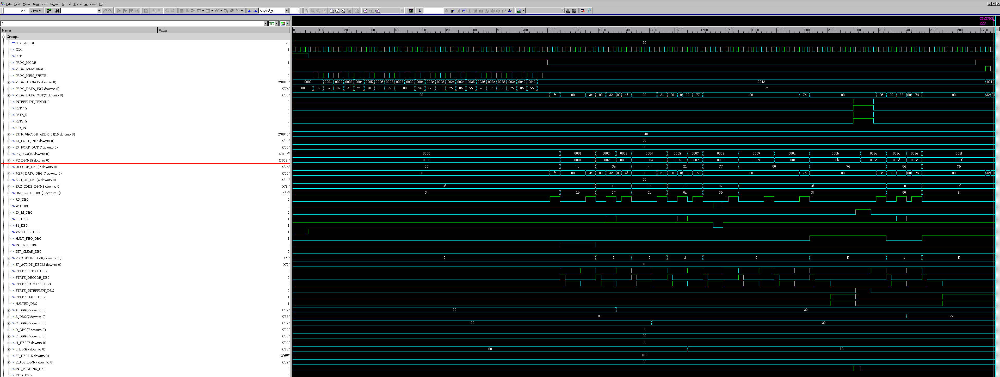
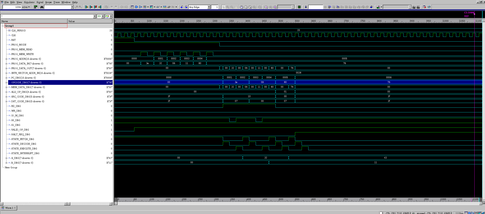

An Intel 8085 microprocessor modelled in VHDL for the Microprocessor System Design
course. The brief asked for the control unit and instruction decoder. The design goes
further and wraps them in a working processor, with an ALU, a register file, flags, a
stack pointer, a program counter and memory.

The decoder recognises all 256 opcodes and turns each into ALU, register, memory and I/O
control signals. A state machine sequences every instruction through fetch, decode and
execute, with separate states for servicing an interrupt and for halt. An interrupt
controller handles RST7.5, RST6.5, RST5.5 and INTR in priority order, along with EI, DI
and the SIM masks.

Everything was simulated in Synopsys VCS. One testbench loads a short program, runs it,
and asserts the register and memory contents afterwards. It then raises all four
interrupts at once, and the waveform shows the processor vectoring to 003Ch, the RST7.5
handler and the highest priority.

