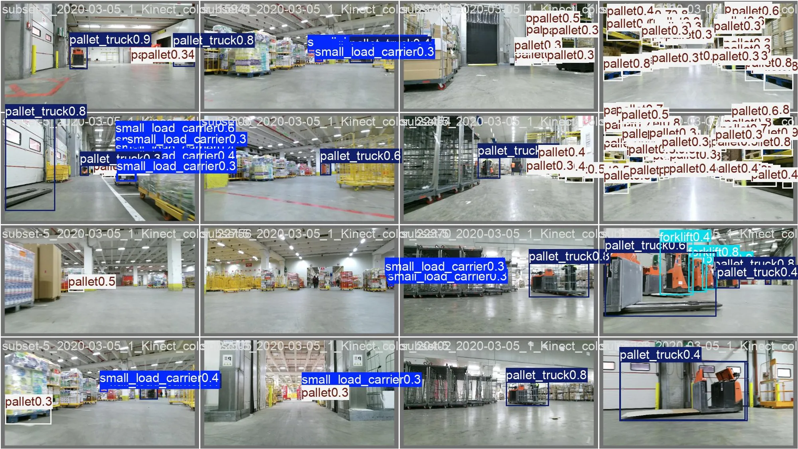

LOCO is 5,593 annotated photographs of real warehouses, with five classes: pallets,
small load carriers, stillages, forklifts and pallet trucks. The split is cross-scene.
Models train on three recording campaigns and are tested exactly once, at the end, on
two warehouses they have never seen, so the score measures generalisation rather than
memorised near-duplicate frames.

The brief rewards Pareto-optimality across three axes — mAP@0.5 up, parameters down,
GFLOPs down — so the project ships two models. Both beat the given Faster R-CNN
MobileNetV3 baseline (25.5% mAP, 18.95M parameters, 23.8 GFLOPs) on all three. YOLO26s
reaches 38.0% with half the parameters; YOLO26n reaches 30.6% with 2.38M parameters and
5.3 GFLOPs. For context, the LOCO paper's own cross-scene YOLOv4 reaches 41.0% with
about 64M parameters.

Every lever was isolated in a one-variable comparison, and the modern architecture is
not what closed the gap: at matched augmentation, YOLO26 and Faster R-CNN land within
0.8 points of each other. Augmentation aimed at the camera and lighting differences
between warehouses is worth 11.1 points, and pretraining underpins all of it — trained
from scratch, the same model scores 23.8%, below the baseline. Knowledge distillation
from a YOLO26m teacher that never ships adds a small but consistent 0.6 points at no
cost in parameters or GFLOPs, and fusing each convolution with its batch norm at export
trims 4.9% of parameters with identical accuracy.

