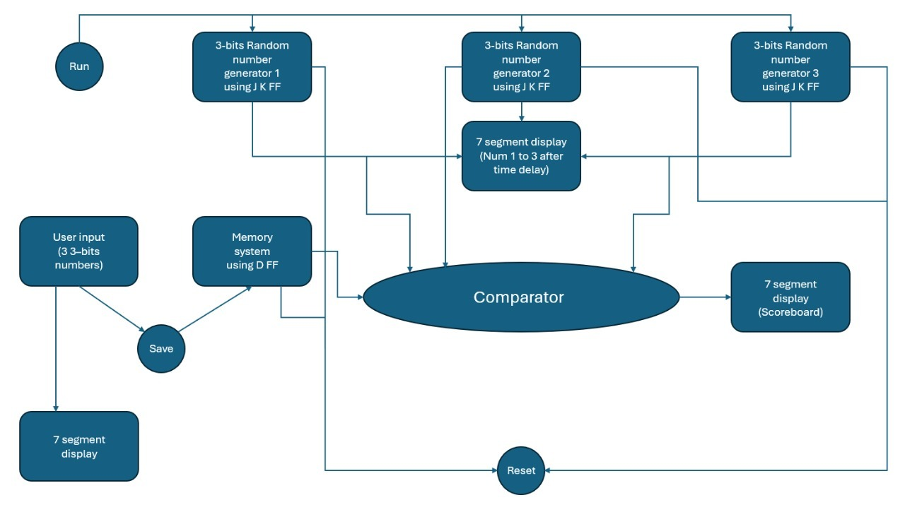
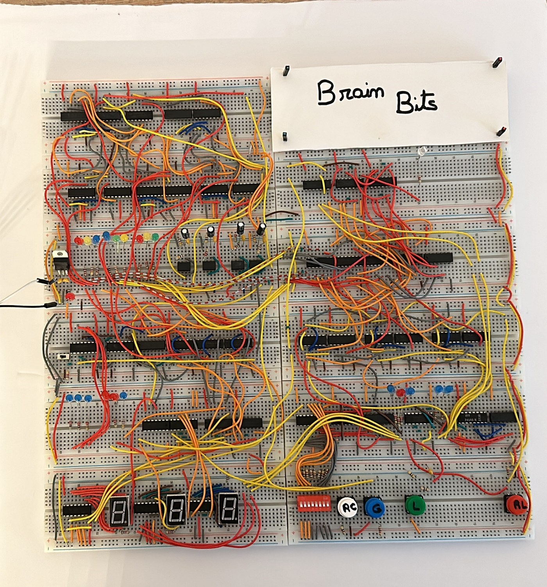

A memory game designed and built with a teammate for the Logic Design Lab, entirely from
logic ICs with no microcontroller. It shows three random numbers from 1 to 6, the player
enters them back from memory, and a scoreboard counts perfect rounds.

Each number comes from its own 3-bit generator built from JK flip-flops, clocked by a
555 timer at 2 Hz, 447 Hz or 583 Hz. A Generate button enables the three clocks through
AND gates, and the values the generators land on are stored in their flip-flops. A 74161
counter on a 1 Hz clock then drives a 74155 demultiplexer that shows the three numbers
one at a time on a single seven-segment display before blanking it.

The player answers on six switches. A 74148 priority encoder turns the chosen switch into
a 3-bit value, shown on its own display, and each press of Load stores it in the next bank
of D flip-flops, stepped by a second 74161 and 74155. An XOR and AND comparator checks all
three guesses against the generated numbers, and only a full match clocks the scoreboard
counter.

