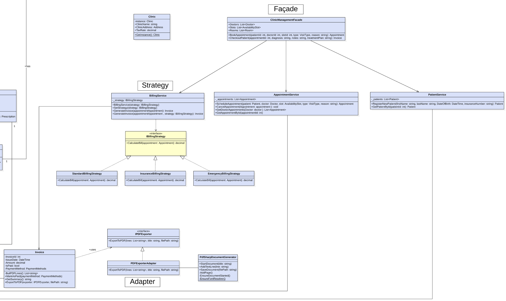
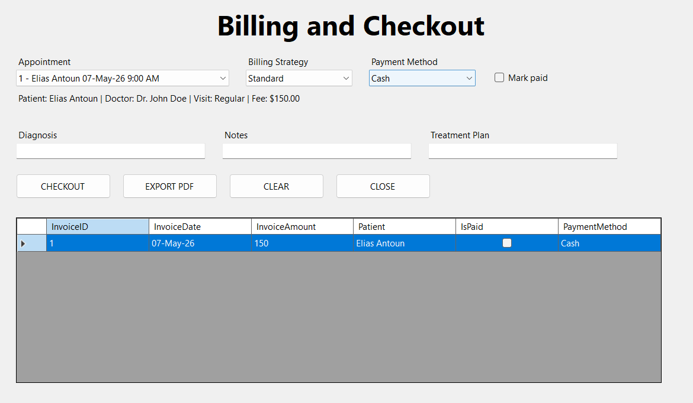
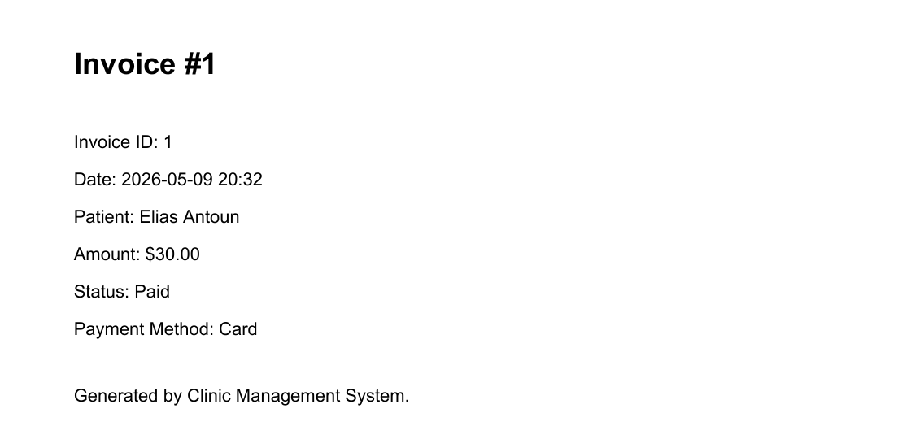

A clinic management desktop application in C# and Windows Forms, designed and built with
two teammates for the Object-Oriented Design course. It registers patients and doctors,
manages departments, rooms and time slots, books appointments after checking that the
slot and the doctor are free, keeps medical records and prescriptions, and bills each
visit.

The design rests on three Gang of Four patterns. A ClinicManagementFacade gives the forms
two simple operations, BookAppointment and CheckoutPatient, so the UI never coordinates
the patient, appointment and billing services itself. Billing is a Strategy: standard,
insurance and emergency rules each implement IBillingStrategy, so a new rule is a new
class, not a change to BillingService. Invoices export to PDF through an Adapter that
hides the PDFsharp library behind a small IPDFExporter interface.

The same visit shows the Strategy at work: a $150 consultation on the billing screen
becomes a $30 invoice under the insurance rule, which charges 20% of the fee.

