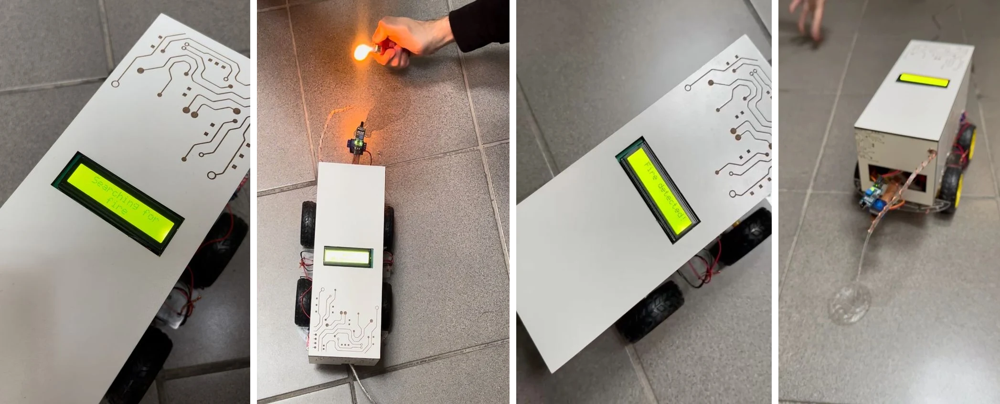
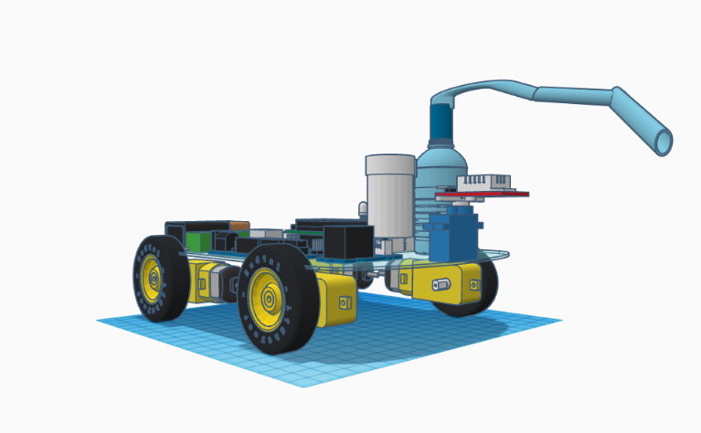
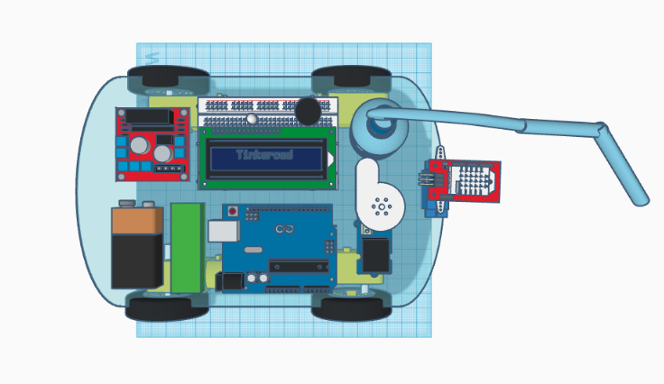

An autonomous fire-fighting robot car, built with two teammates for the Introduction to
Engineering Lab on an Arduino Uno. A flame sensor on an SG90 servo sweeps from 0 to 180°
in 10° steps. When a reading crosses the threshold, the car turns toward the sector the
flame was found in, drives up to it through an L298N motor driver, and runs a submersible
pump for two seconds, while an LCD shows "Searching for fire" and then "Fire detected!".

The team scored a remote-controlled design against a fully autonomous one on a weighted
concept table, chose the autonomous one, and modelled the circuit and a 3D design in
Tinkercad before building it. In testing, the robot started moving 4.3 seconds after
detecting a flame on average, located the source within 15 cm, and put out all ten test
fires, from candles to small paper fires, within 30 seconds of spraying.

