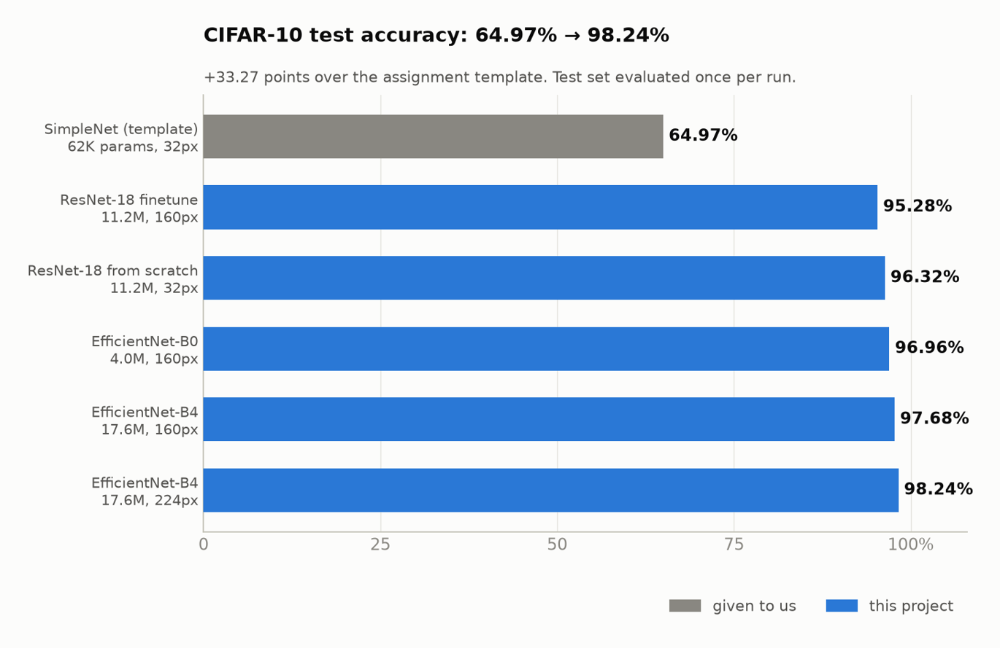
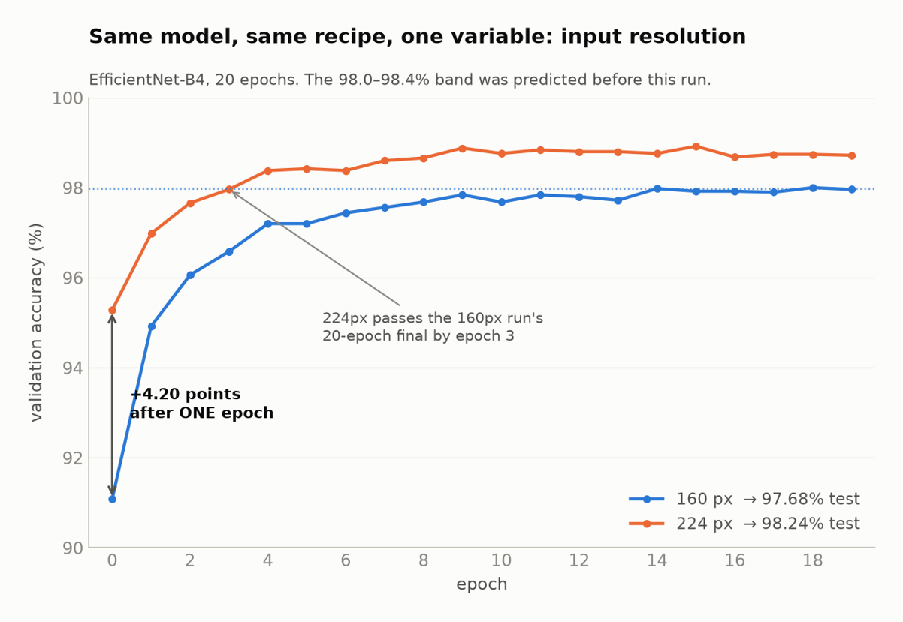
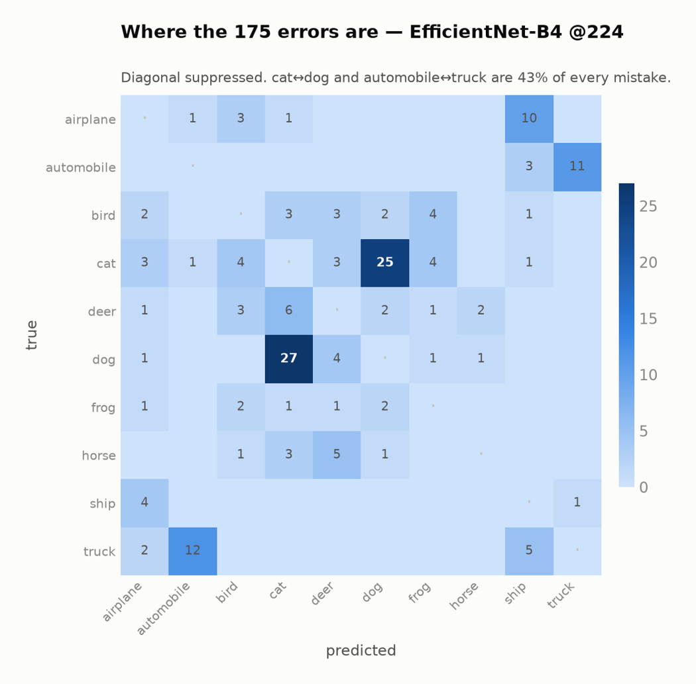

Four architectures were trained and compared under a consistent harness: the
assignment's LeNet-5-style template, SimpleNet (62K parameters), ResNet-18 both trained
from scratch and finetuned from ImageNet, and ImageNet-pretrained EfficientNet-B0 and
B4. Each run records parameter count, input resolution, epochs, test accuracy, and
wall-clock time, so accuracy gains can be weighed against their compute cost rather than
reported in isolation.

The from-scratch ResNet-18 needs 200 epochs to finish at 96.32%. The pretrained
backbones are finetuned for 15 to 30 epochs, and the EfficientNets pass 91% after their
first.

Every configuration is committed as a YAML file, which made the ablation sequence
reproducible — and in one case allowed the outcome of a change to be predicted in the
config before the run was executed. Raising EfficientNet-B4's input resolution from
160px to 224px, with the same recipe and 20 epochs, was predicted to land between 98.0%
and 98.4%. It reached 98.24% on test, up from 97.68%.

Of the 175 test images the final model still gets wrong, 43% are cat–dog or
automobile–truck confusions.

