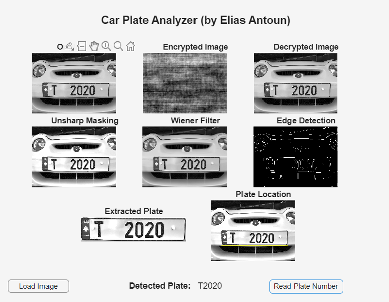

A detection and recognition system built with MATLAB App Designer. Plate regions are
located through edge detection, characters are segmented and extracted automatically, and
each is identified by correlation against a reference set.

The app shows every stage side by side: unsharp masking and a Wiener filter to clean up
the image, the edge map, the located and extracted plate, and the recognised text.

The pipeline also applies FFT-based encryption and decryption to the captured image, tying
the frequency-domain work to a concrete purpose rather than treating it as an isolated
exercise.
