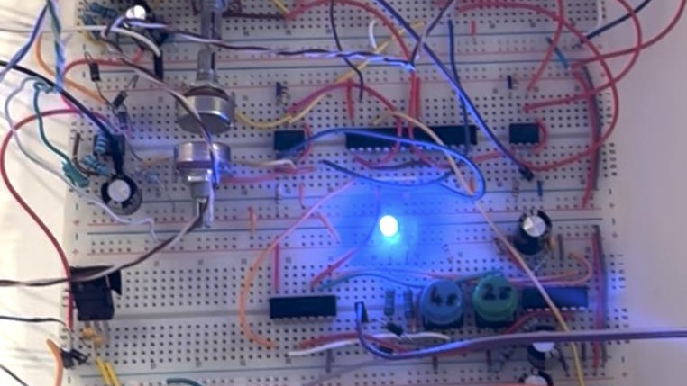
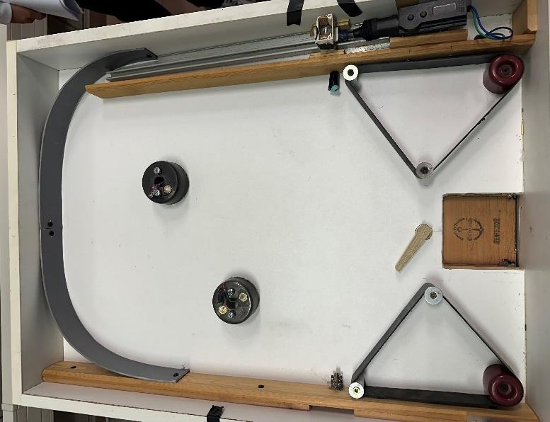

The scoring and drain subsystem of a pinball machine built by a team for the Electronic
Circuits Lab, where the player's score is the water level in a tank. It uses no
microcontroller: sensing, grading and timing are all analog circuits.

A piezoelectric plate on the bumper picks up each ball impact. Its 0–0.7 V output is
amplified tenfold by an inverting µA741 stage, clamped to 0–5 V with diodes, and smoothed
to a DC level by a half-wave rectifier. Two LM393 comparators with 3 V and 4 V references
grade the hit: the low comparator alone means a light hit, both together a hard one.

Each grade triggers one half of a 556 dual timer, a 2-second pulse for a light hit and
4 seconds for a hard one. The two outputs are combined through diodes into an L298N
H-bridge that drives a 12 V submersible pump filling the scoring tank.

When a ball drains, it breaks an infrared beam between two facing modules. The inverted
signal fires a 555 timer for 2 seconds, switching a relay that opens a 12 V solenoid
valve and lets water out, lowering the score.

