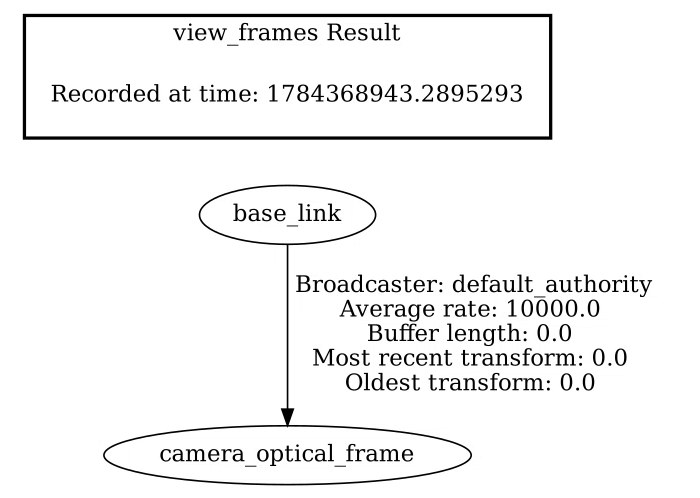
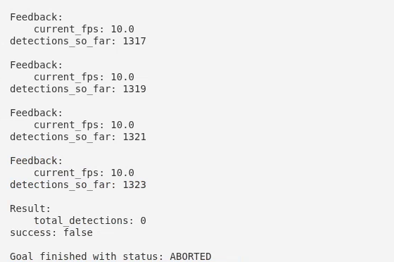

Two nodes cooperate. `perception_manager` runs detections on demand, driven by an action
goal so that long-running work reports progress and can be cancelled.
`camera_tf_broadcaster` publishes the static camera transform once at startup, giving
detections a frame to be expressed in.

The action server is also preemptable. A new goal arriving mid-run aborts the current one,
whose client receives `success: false`, and the new goal starts executing in the same
process, with no restart.

The package defines its own interfaces rather than reusing generic messages: a
`StartDetection` action, a `Detection` message, and a `SetConfidenceThreshold` service.
Choosing the right ROS 2 communication primitive for each interaction — action for
long-running goals, service for synchronous configuration, topic for streams — is the
substance of the exercise.
