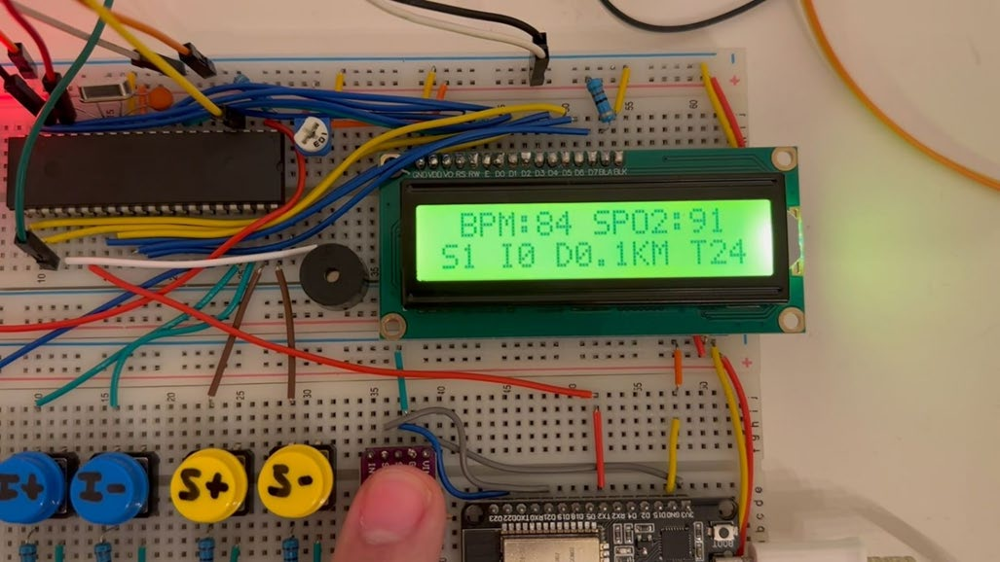
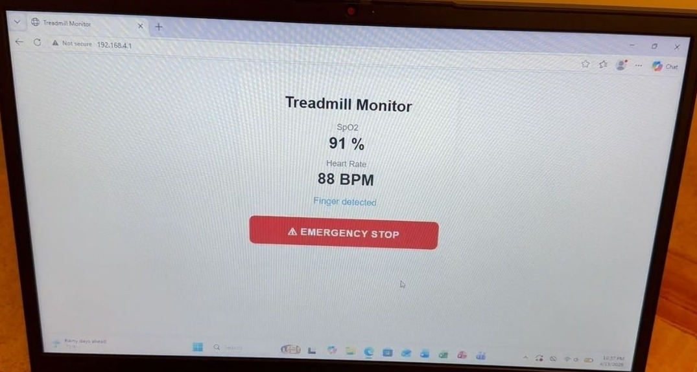
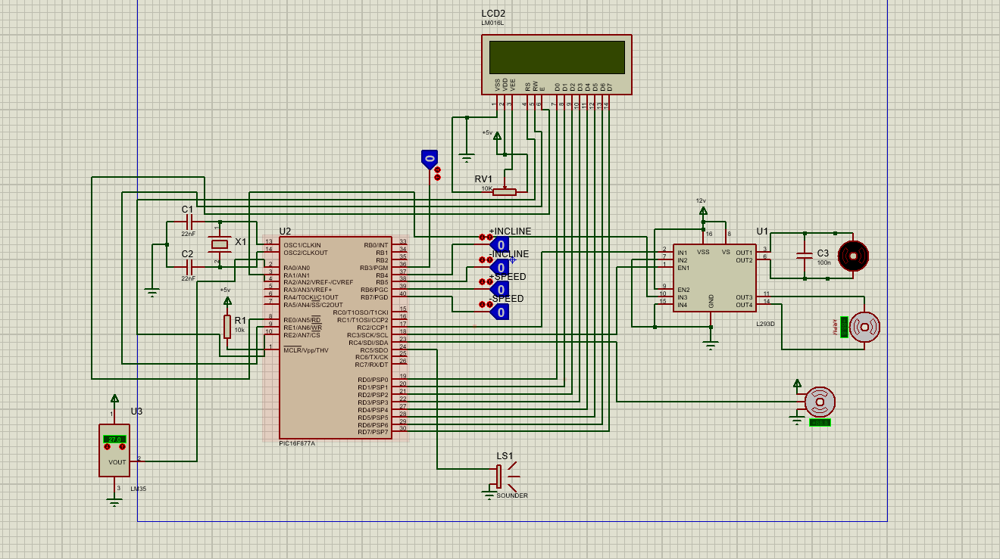

A treadmill prototype with health monitoring, built with a teammate for the
Microprocessor Lab. Two controllers split the work.

A PIC16F877A, programmed in assembly, runs the treadmill. Five push buttons start it and
set speed and incline, CCP1 PWM drives the belt motor at three speed levels, a servo
raises the incline, and Timer1 overflows accumulate the distance. An LM35 read through
the ADC switches an alert fan on above 20 °C, and a 16×2 LCD shows everything.

An ESP32 reads a MAX30102 pulse oximeter: SpO₂ from the ratio of its red and infrared
signals, and heart rate from peaks in the infrared signal. It shows both on a Wi-Fi
webpage, which also has an emergency-stop button that halts the treadmill, and sends them
to the PIC as a three-byte UART frame at 9600 baud. The frame starts with a 0xAA marker,
so the PIC can reject partial frames.

The PIC checks the UART without blocking and recovers from overrun errors, so the
treadmill keeps responding while it waits for health data. The whole system was
simulated in Proteus before it was built.

